# ◓ Champions Coach

**Asistente competitivo para Pokémon Champions**: ranking del meta, reclutamiento inteligente, armado de equipos, recomendación de builds y objetos, análisis de enfrentamientos y un asistente de combate turno a turno — para **Individuales** y **Dobles (VGC)**.


> Daños calculados con [`@smogon/calc`](https://github.com/smogon/damage-calc) usando las **mecánicas reales de Pokémon Champions** (nivel 50, Stat Points 66/32, Megas nuevas como Mega Floette o Garchomp Mega Z). Interfaz en español; nombres de movimientos en español con el inglés entre paréntesis.

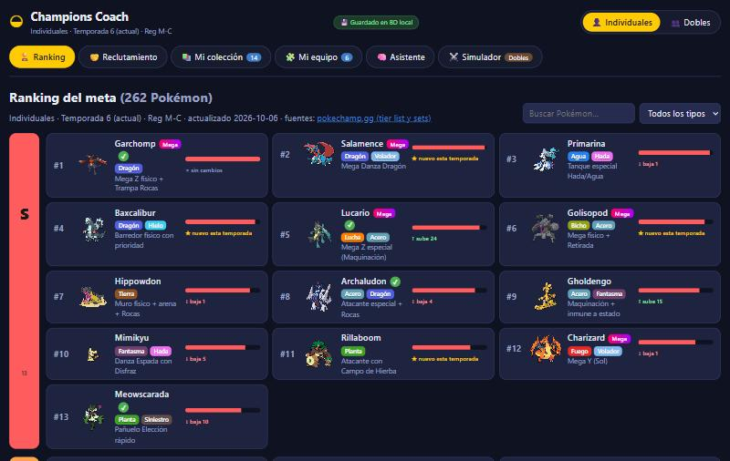

---

## Índice

- [Funciones](#funciones)
- [Capturas](#capturas)
- [El meta en gráficas](#el-meta-en-gráficas)
- [Instalación y uso](#instalación-y-uso)
- [Arquitectura](#arquitectura)
- [Cómo decide la app](#cómo-decide-la-app)
- [Datos y actualización](#datos-y-actualización)
- [Estructura del proyecto](#estructura-del-proyecto)
- [Limitaciones](#limitaciones)

---

## Funciones

| Pestaña | Qué hace |
|---|---|
| 🏆 **Ranking** | Los **262 Pokémon** del ladder de cada formato en tiers **S → F**, con puesto, tendencia respecto a la temporada anterior y el **set más usado con el % de jugadores** que lleva cada parte. |
| 🤝 **Reclutamiento** | **🎲 Selección del juego**: registras los candidatos que te ofrece el juego *tal como vienen* (habilidad, ataques, naturaleza, Stat Points) y te dice **cuál elegir**: calidad del ejemplar, aporte a tu equipo, enfrentamientos contra el meta y si **ya tienes uno igual o mejor**. **🔍 Buscar Pokémon**: catálogo visual filtrable por nombre y tipo. **🤝 Sinergia por habilidad**: quién combina con tu equipo (climas, campos, Liviano + semillas, Pararrayos, Espacio Raro…). **🎒 Mis objetos**: reparto óptimo de tu inventario. |
| 📚 **Mi colección** | Todos tus reclutados con **tu set** (el mismo en individuales y dobles). **🩺 Observaciones del equipo** (debilidades compartidas, roles que faltan, amenazas, objetos, sets mejorables), mejores incorporaciones/cambios, aporte de cada miembro y **armado automático** del mejor equipo. |
| 🧩 **Mi equipo** | Equipo de 6 por formato: tabla defensiva, cobertura ofensiva, roles, amenazas del meta y recomendaciones. |
| 🧠 **Asistente** | **Individuales (3 vs 3)** o **Dobles (2 vs 2)**: configuras la situación (PS, estados, debilitados, cambios de stats, clima, campo, Espacio Raro, Viento Afín, pantallas) y te recomienda **atacar o cambiar**, predice al rival y muestra el daño exacto. |
| ⚔️ **Simulador** | Combates dobles contra una IA con equipos del meta, con botón **💡 Consejo**. |

**Editor de sets** (desde cualquier Pokémon), con tres pestañas:

- ✏️ **Editar** — habilidad, objeto, naturaleza y movimientos con **listados buscables** (español o inglés) que marcan con ★ lo recomendado y explican por qué; solo los movimientos que puede aprender.
- 🛠 **Build recomendado** — movimientos, habilidad, objeto, naturaleza y Stat Points ideales, comparados con tu set y con el del meta.
- ⚔️ **Fuerte / Débil** — tipos y contra qué Pokémon del meta gana o pierde, con daño real y velocidad.

---

## Capturas

| Selección del juego: ¿a quién recluto? | Observaciones de tu equipo |
|---|---|
| 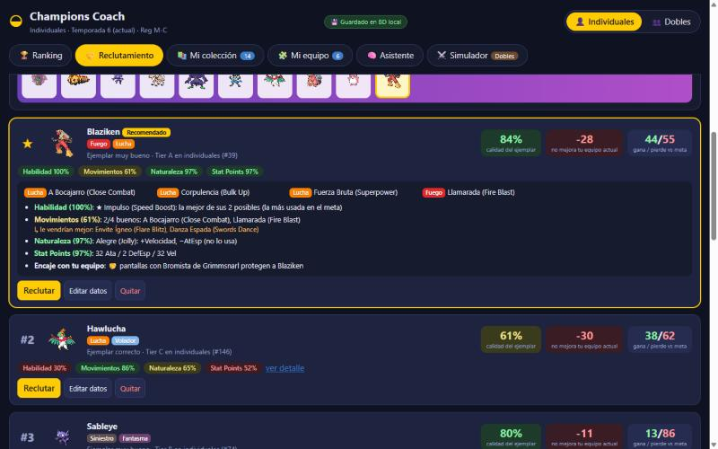 | 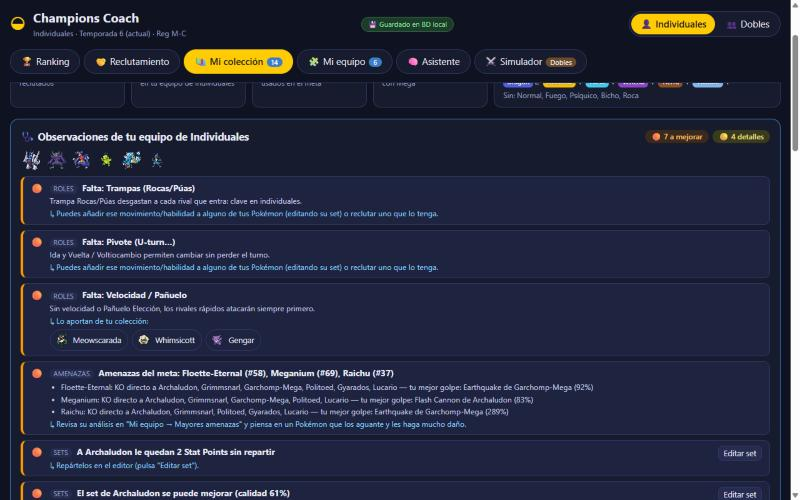 |
| **Build recomendado** | **Fuerte / Débil contra el meta** |
| 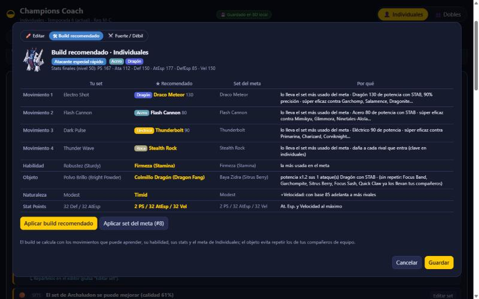 | 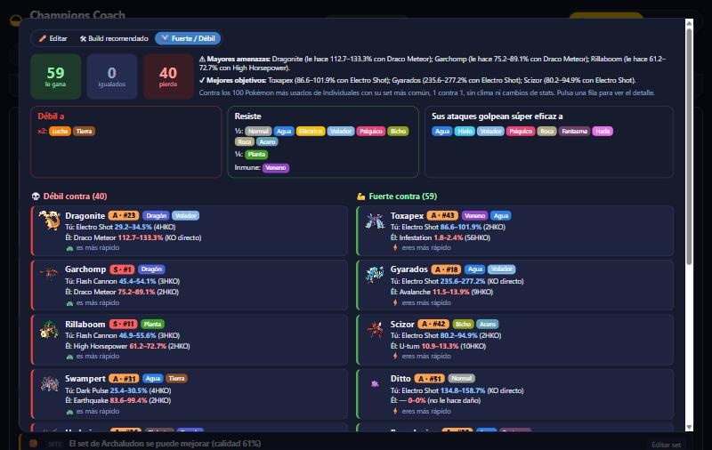 |

**Asistente de turno (individuales, 3 vs 3)**

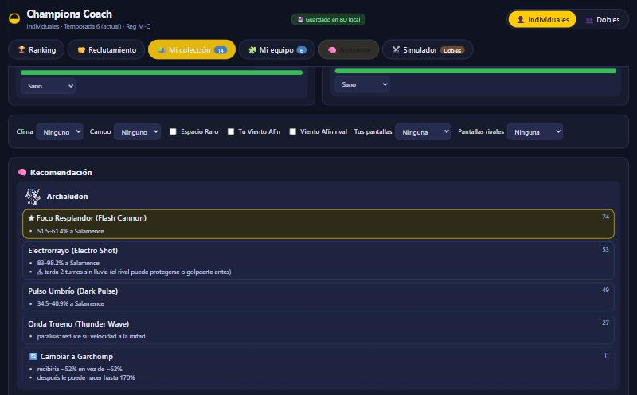

---

## El meta en gráficas

*Datos de [pokechamp.gg](https://pokechamp.gg/tier-list/singles/pokemon), temporada 6 (Reg M-C), 6 de octubre de 2026. Los % de dobles son de [Pikalytics](https://www.pikalytics.com/).*

### Reparto de tiers (262 Pokémon por formato)

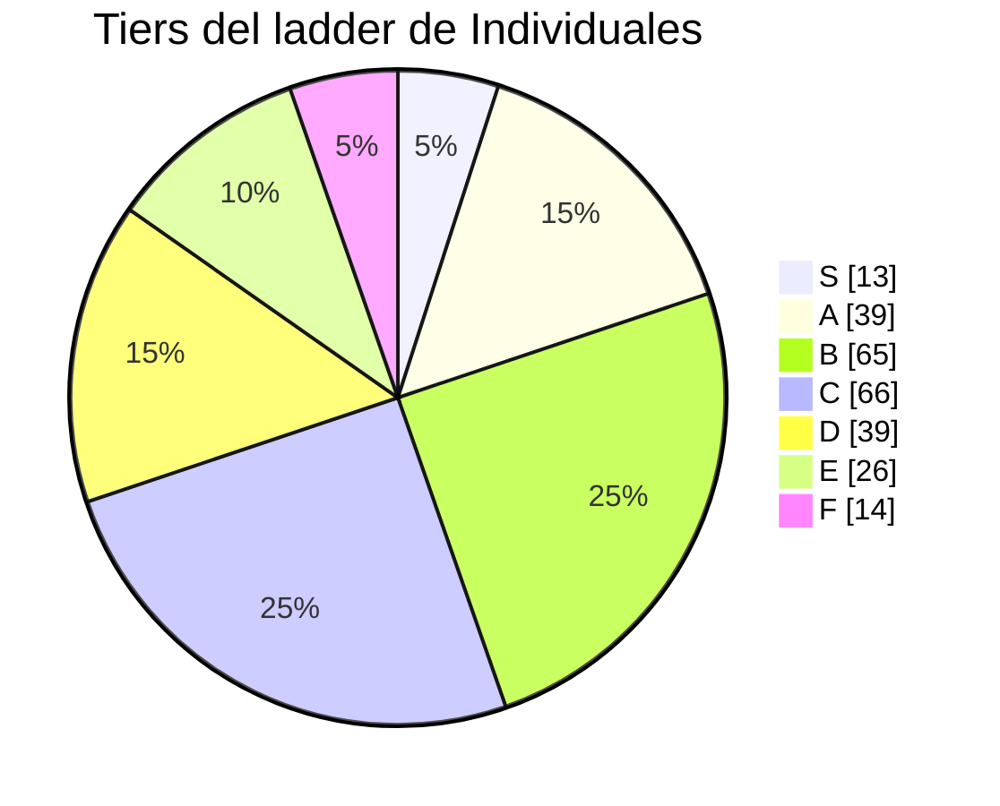

### Los más usados en Dobles (% de equipos)

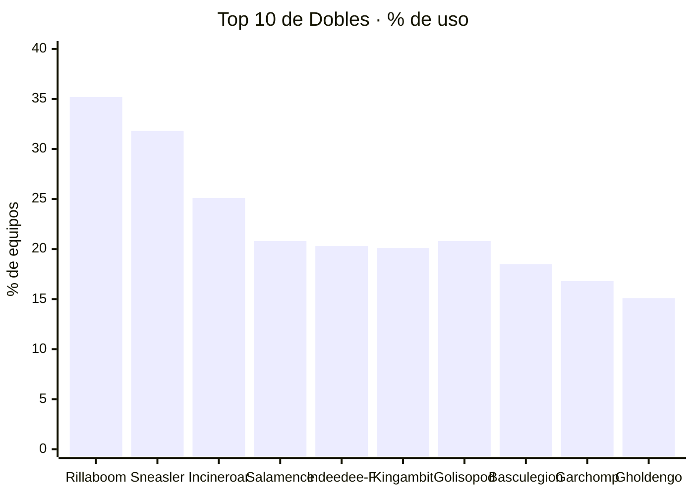

### Tipos más presentes en el Top 50

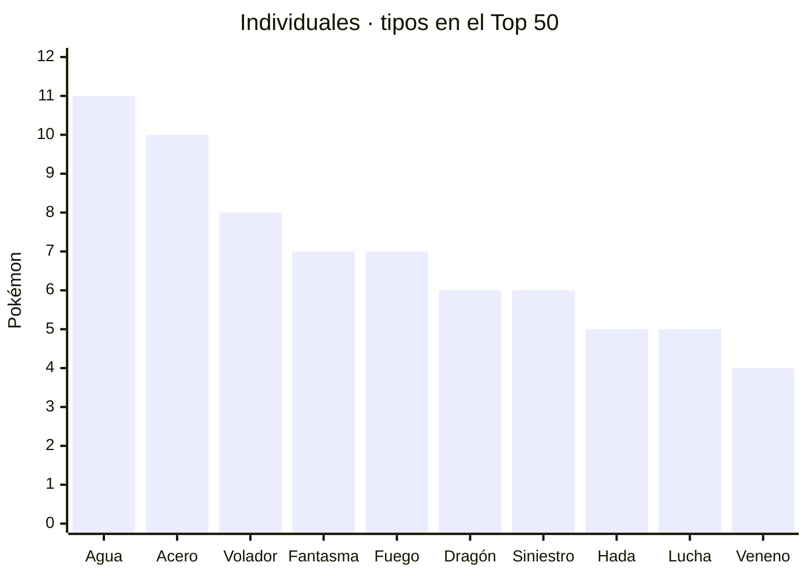

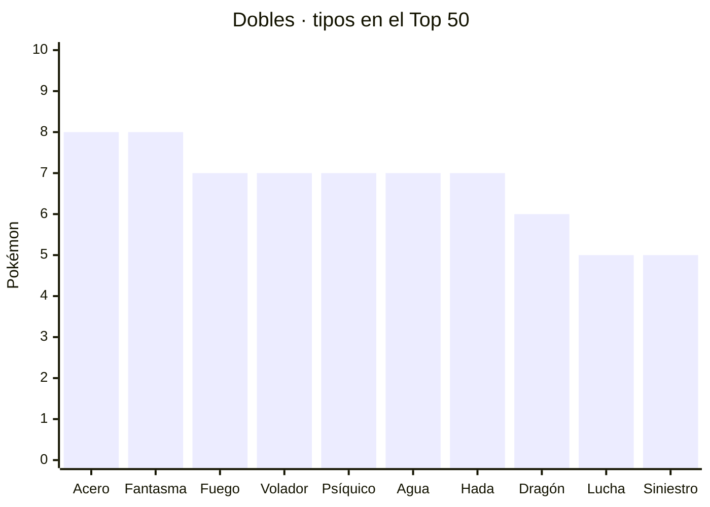

> 18 de los 50 más usados en individuales (y 19 en dobles) llevan **megapiedra**.

---

## Instalación y uso

Requisitos: **Node.js 22** o superior (incluye el SQLite que usa la app).

```bash
git clone https://github.com/zseuz/pokemon-champions.git
cd pokemon-champions
npm install
npm run dev
```

Abre <http://localhost:5173>. Elige el formato arriba a la derecha (**👤 Individuales / 👥 Dobles**).

| Comando | Para qué |
|---|---|
| `npm run dev` | App + API local (base de datos) en modo desarrollo |
| `npm run build` / `npm run preview` | Compilar y servir la versión de producción (con la API) |
| `npm run gen:meta` | Descargar el meta actual (tiers y sets) de pokechamp.gg |
| `npm run gen:abilities` · `gen:learnsets` · `gen:es` | Regenerar habilidades, movimientos por especie y nombres en español |
| `npm run validate` | Comprobar que todos los sets del meta son válidos |
| `npm run lint` | Linter |

### Dónde se guardan tus datos

En una **base de datos SQLite local**: `data/champions.db` (no se sube a git). Una pequeña API MVC (`server/`: rutas → controlador → modelo) se monta dentro del servidor de Vite, así que no hay que arrancar nada más. El navegador guarda además una copia; si la API no responde, la cabecera muestra *"⚠ Solo en el navegador"*.

| Tabla | Contenido |
|---|---|
| `collection` | Tu colección: cada Pokémon con **tu set** (igual en ambos formatos) |
| `team_members` | Equipos de individuales y dobles |
| `inventory` | Tus objetos |
| `candidates` | La selección de reclutamiento en curso |
| `settings` | Formato elegido |

---

## Arquitectura

El proyecto sigue el patrón **MVC (Modelo – Vista – Controlador)**, tanto en el navegador como en el servidor:

| Capa | Carpeta | Responsabilidad |
|---|---|---|
| **Model** | `src/models/` | Datos y reglas del juego: meta, Pokémon, sets, cálculo de daño, motor de combate, IA, análisis (sinergias, builds, objetos, observaciones) y persistencia. **No sabe nada de la interfaz.** |
| **View** | `src/views/` | Pantallas y componentes React. Solo **muestran** lo que les da el controlador y le **avisan** de los eventos (clics, cambios). |
| **Controller** | `src/controllers/` | Hooks `useXController` con el **estado** de cada pantalla y las **acciones**: llaman a los modelos y entregan a la vista datos listos para pintar. |
| Servidor | `server/` | `routes.ts` (rutas) → `controllers/stateController.ts` → `models/stateModel.ts` (SQLite). |

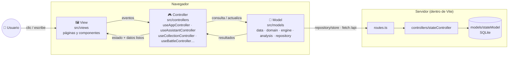

### Controladores

| Controlador | Pantalla | Qué gestiona |
|---|---|---|
| `useAppController` | App | Pestaña, formato, colección, equipos, inventario, guardado |
| `useRankingController` | Ranking | Búsqueda, filtros y tiers desplegados |
| `useRecruitController` · `useSelectionController` · `useSynergyController` · `useItemsController` | Reclutamiento | Subpestañas, candidatos y su evaluación, sinergias, reparto de objetos |
| `useCollectionController` · `useTeamReviewController` | Mi colección | Encaje con el equipo, observaciones, armado automático, guardar sets |
| `useTeamBuilderController` | Mi equipo | Tabla defensiva, cobertura, roles, amenazas, recomendaciones |
| `useAssistantController` | Asistente | Escenario (3 vs 3 / 2 vs 2), recomendaciones, cambios, daño |
| `useSimulatorController` · `useBattleController` · `useActionPickerController` | Simulador | Vista previa, turno, consejo, acciones de cada Pokémon |
| `useSetEditorController` · `useBuildController` · `useMatchupController` | Editor de sets | Opciones recomendadas, build ideal, fuerte / débil |

### Cómo se generan los datos

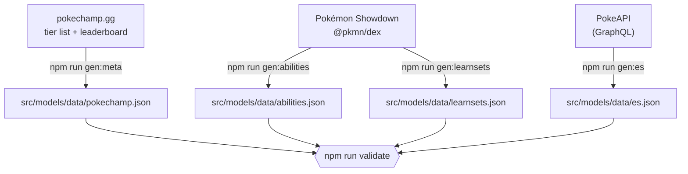

### Un Pokémon, un set

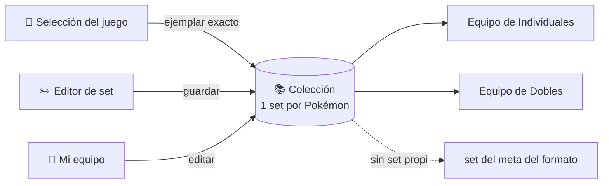

---

## Cómo decide la app

**Asistente de turno.** Para cada movimiento × objetivo calcula el daño real (16 tiradas), la probabilidad de KO, la precisión, la prioridad y cuánto te amenaza ese rival; añade heurísticas de cada formato (Fake Out, Protección, Viento Afín, Espacio Raro, redirección en dobles; trampas y cambios en individuales). En individuales valora siempre **cambiar**: daño que recibiría el que entra, su vida y lo que podrá hacer después.

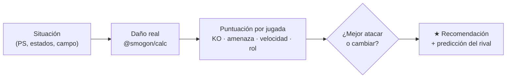

**Selección del juego.** Califica el ejemplar (habilidad 30 %, movimientos 40 %, naturaleza 18 %, Stat Points 12 %) frente al build ideal, mide su aporte al equipo con el mismo modelo que el armado automático, su balance contra los 100 más usados y, si ya tienes esa especie, si **mejora tu ejemplar**.

**Armado automático.** Busca la combinación que maximiza fuerza en el meta + sinergia de habilidades + roles cubiertos − debilidades compartidas (búsqueda exhaustiva si hay pocas combinaciones; voraz con intercambios si hay muchas).

**Objetos.** Puntúa cada objeto para cada Pokémon (megapiedras, objetos de tipo, bayas de resistencia según los ataques del meta, Banda Focus para frágiles, Pañuelo Elección…) y busca el **reparto óptimo** sin repetir objetos y valorando menos la segunda Mega.

---

## Datos y actualización

| Dato | Fuente | Comando |
|---|---|---|
| Ranking, tiers y sets más usados | [pokechamp.gg](https://pokechamp.gg/tier-list/singles/pokemon) | `npm run gen:meta` |
| % de uso de dobles | [Pikalytics](https://www.pikalytics.com/) | a mano en `src/models/data/meta.ts` |
| Mecánicas, especies y daño | [@smogon/calc](https://github.com/smogon/damage-calc) | `npm update @smogon/calc` |
| Habilidades y movimientos por especie | [Pokémon Showdown](https://github.com/pkmn/ps) (`@pkmn/dex`) | `gen:abilities`, `gen:learnsets` |
| Nombres en español | [PokeAPI](https://pokeapi.co/) | `npm run gen:es` |

Al empezar una temporada nueva la cabecera muestra **🆕 ¡Temporada nueva!**: un clic descarga y valida el meta (equivale a `npm run gen:meta && npm run validate`). El botón **🔄 Meta** comprueba manualmente si hay datos nuevos. Los nombres que Champions traduce distinto a los juegos anteriores (p. ej. *Acrobacia*, *Golpe Venenoso*) se añaden en `CHAMPIONS_MOVES` de `src/models/domain/es.ts`.

---

## Estructura del proyecto

```
pokemon-champions/
├── server/                      Servidor MVC (se monta dentro de Vite)
│   ├── routes.ts                rutas /api/* y plugin de Vite
│   ├── controllers/             stateController: lógica de cada petición
│   └── models/                  stateModel: base de datos SQLite (data/champions.db)
├── src/
│   ├── App.tsx                  une controlador y vista (punto de entrada MVC)
│   ├── controllers/             hooks useXController (estado + acciones) y viewModels
│   ├── models/
│   │   ├── data/                meta.ts + JSON generados (pokechamp, abilities, learnsets, es)
│   │   ├── domain/              dex, sets, habilidades, nombres en español, efectos de movimientos
│   │   ├── engine/              battle (motor de combate), ai (asistente/IA), opponents
│   │   ├── analysis/            teamAnalysis, synergy, build, items, candidates, observations
│   │   └── repository/          store: persistencia (navegador + API local)
│   └── views/
│       ├── AppView.tsx          cabecera, pestañas y página activa
│       ├── pages/               RankingView, RecruitView, SelectionView, CollectionView,
│       │                        TeamBuilderView, AssistantView, SimulatorView
│       ├── components/          SetEditor, Insight, TeamReview, Picker, SpeciesSelect…
│       ├── format.ts · theme.ts formateadores de texto y colores
│       └── styles.css
├── scripts/                     generadores de datos y validación
└── docs/screenshots/            capturas del README
```

## Limitaciones

- El **simulador** es de dobles; efectos poco comunes (Otra Vez, Canto Mortal…) no están implementados y el registro lo avisa.
- Los enfrentamientos son 1 contra 1 contra el set más común de cada rival, sin clima ni cambios de stats: son una guía, no un combate real.
- Los movimientos que puede aprender cada Pokémon vienen de Showdown; si Champions cambia alguno, se regeneran con `npm run gen:learnsets`.
- Unos 50 movimientos de 9.ª generación no tienen nombre en español en PokeAPI y se muestran en inglés.

---

<sub>Proyecto de fans sin afiliación con Nintendo, Game Freak, Creatures o The Pokémon Company. Pokémon y sus nombres son marcas de sus respectivos propietarios. Sprites de Pokémon Showdown.</sub>
